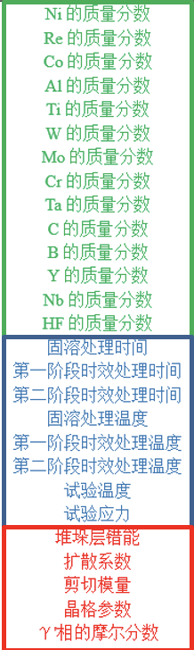
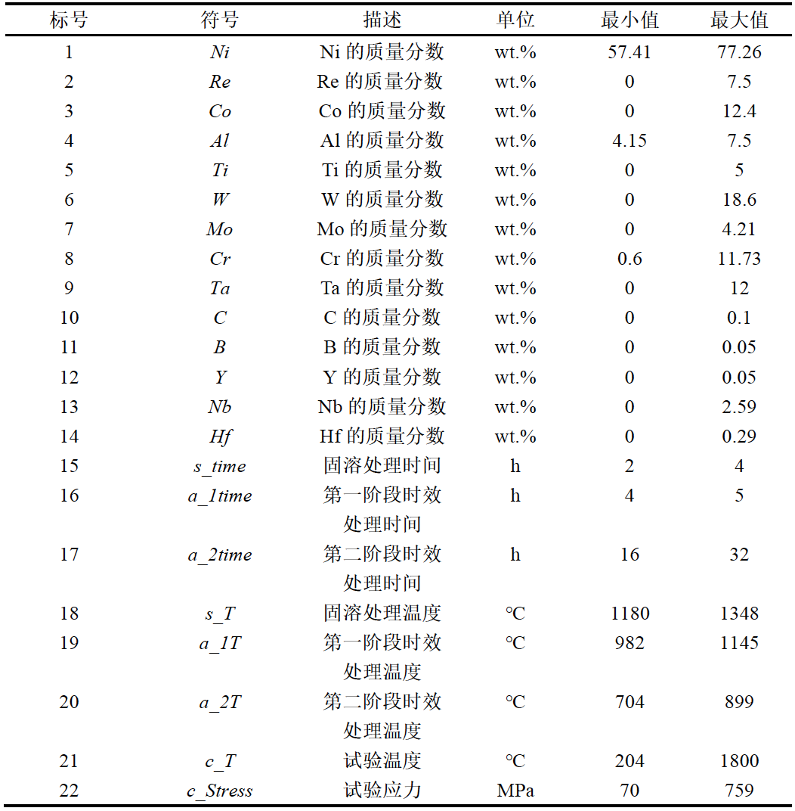

# 高温合金

## 1.实体类型

***总共11个实体类型***

### (1) Characterization

Characterization method：**表征手段**，包括用来表征材料、实验或理论的任何**方法**、**模型**、**理论**或**公式**

例如：XRD, TEM, LSW, DFT, Rabotnov-Kaehanov‘s formulation, Bethe-Salpeter equation、一些数值计算方法的名称、一些以人为名的计算公式、**显微镜**等等


### (2) Condition

**环境/试验条件**，包括描述材料所处的环境（外部条件）

例如：1050 degree C（1050摄氏度），100MPa，5h，温度，压强，时间、试验应力等，

950 degree C / 200MPa...

- **==重点关注的条件==**：**试验温度**、**试验应力**、应力时效、外加应力


### (3) Processing

- **加工/合成**，具体指合成材料的任何技术，材料制备方法及其子步骤 **(Synthesis method)**

例如：pulsed laser deposition（沉淀技术），solid state reaction（固相法），annealing, etching, **heat treatment**(**热处理**)，冷却，加热，**固溶**、CFDG(creep-feed deep grinding)等等。

- 加工/合成过程中的工艺用品
- **==重要的热处理(heat treatment)工艺参数==**：固溶处理时间(h)、**第一阶段(the first aging)**时效处理时间(h)、**第二阶段(the second aging)**时效处理时间(h)、固溶处理温度(degree C)、第一阶段时效处理温度(degree C)、第二阶段时效处理温度(degree C)，例如**1300 degree C / 4 h ==AC==**，AC——air cooling(空冷)

- **一些工艺参数，视具体语境，可定为condition，也可定为processing**


### (4) Feature

Special descriptions of the type/shape of the sample. **==样品类型/形貌的特殊描述== (Sample descriptor)**

**样品类型**：

- **合金代数**：first-generation、second-generation

- **single crystal**（单晶）、多晶、共晶、准晶；
- **nickle-base（镍基）或其它基**
- 镍基单晶高温合金、单晶合金、镍基合金、镍基单晶合金、合金/xx合金、带元素名的合金/金属（**Ni3Al合金**、**NiCr23Fe**、**NiCr21Mo**）、有色金属等（都是**泛指某一大类的材料**）；
- **一些特别指代的合金/材料名称**：Ru with/-free single crystal nickel-based superalloys（含Ru/不含Ru的...）

**样品形貌**：

- 缺口（notch）、缺口试样（notched specimens）、**xx试样**、xx合金试样等（必须指明是某一具体试样,如果只是试样这种词就不要标）、**xx材料**（必须特别指明为某一类材料，如果只是指材料就不要标）
- film-cooling hole（薄膜冷却**孔**）、film hole（膜**孔**）等**各种hole**；薄壁结构(thin-walled structures)
- **涂层**、覆盖层
- **宏观/界观形貌**：（肉眼可见的纹路或区域，或者非晶体微观结构的界观形貌）
  - **裂纹**（crack/fracture：作为名词时，是裂纹）、**缺口**（notch）、**孔（hole）**、**断口**、解理条纹、疲劳裂纹等；
  - 一些外观可见的**区域**：疲劳宏观断口特征：**疲劳裂纹源区**、**疲劳裂纹扩展区**、**瞬时断裂区**；
  - 其它的一些形貌特征：**韧窝**

- 样品/材料的形状or大小（肉眼可见的形貌外观）、**断口形貌**（平坦、光亮、半圆形或半椭圆形、**纤维状**、**结晶状**）、**区域形貌**（半圆、扇形、贝壳花样等）
- **样品尺寸**：e.g. 80 mm × 15 mm × 80 mm

```python
为什么要把single crystal、nickle-base、镍基单晶高温合金这些短语归为Feature类型：
因为它们都属于对某个样品/材料类型的特殊描述，关键在于“special descriptions”。
```


### (5) Structure

==**晶体/相**的**微观结构**==，具体包括：

- **相名称**：$\gamma/{\gamma}^,$ phase、拓扑密堆(TCP)相（μ相、σ相、Laves相、R相、P相）、固溶体（合金相的一种）
- 与相（phase）相关的名称：相粒子
- $\gamma'$**相（或者其他相）的尺寸**、**形态**和**分布**，$\gamma'$析出相/相析出(gamma' precipitates)及其形态，**析出物(precipitate)**、**基质/基体(matrix)**（==注意precipitate和matrix一般是与**相**相关的结构，不是Feature！==）
- **晶体形态**：**fcc（面心立方）**、bcc（体心立方）、hcp（密排六方）、tetragonal（四面体）、立方体、八面体、球体等
- **晶体粒度**：粗粒度、细粒度
- **晶体缺陷**：
  - **点缺陷**：**空位**、**孔隙**、**间隙**（四面体间隙tetrahedral、八面体间隙octahedral）、**间隙原子**、**杂质原子**、Schottky缺陷、Frenkel缺陷、电荷缺陷
  - **线缺陷**：晶体的线缺陷表现为各种类型的**位错**（**位错是由滑移产生的，位错的运动包括滑移、攀移、交割，它们都是Property！**位错的一些参量或性质如伯氏矢量、应力场、应变能、力、密度等也都是Property！）
  - **面缺陷**：**晶界**、亚晶界、**相界**、孪晶、孪晶界、枝晶竞争生长、杂晶、**堆垛层错**、**堆垛方式**、**层错**(SI**SF**、SE**SF**、C**SF**等)（**堆垛层错能是property**！）

- **堆垛方式**、**层错**(SI**SF**、SE**SF**、C**SF**等)（**堆垛层错能是property**！）、**位错**、漂流（rafting/rafting structure）、孪晶、枝晶竞争生长、杂晶
- **定向凝固缺陷**：元素偏析、取向偏离
- 晶界/相界、孪晶界、亚晶界
- **晶体取向**：[001]/[010]/<110>/<111>等取向、堆垛方向、滑移方向、xx面（如{111}、{110}等）、rafting directions（其他指代方向的短语）、xx orientation(各种取向)、xx轴
- **晶面**：滑移面、解理面、断裂面、横截面、一些具体方向的晶面如{111}、{110}等，滑移系(slip system)
- 晶体**间隙**：四面体间隙（tetrahedral）、八面体间隙（octahedral）
- 断裂**路径**、断裂**面**、xx**轴**

**总之，structure只关注晶体和相，且只关注其微观结构**，**微观结构下可能会有一些对应的属性值或运动（微观结构的属性，例如层错能、相摩尔分数、晶格参数、原子半径、力学的一些参量、位错运动等），这些被划分至property中**


### (6) Property

Property又分为两类：一类是描述属性、行为、现象或其它参量的名词短语，定义为**==Prperty==**；另一类是在句子中与Property共现的对应值，即**==PropertyValue==**。

#### Property

- 材料表现出来的**定性的性质或现象**：蠕变/蠕变寿命/蠕变速率、疲劳表现/疲劳寿命、**各向异性**、弹性性质、**应力状态**
- ==材料的行为、机制或物理/化学过程（**动态**）==：**蠕变、疲劳、变形、应变、氧化、断裂、相转变(相变)、析出**（**疲劳、断裂等是一个变化行为，但疲劳断裂产生的裂纹是属于Feature的**：**行为产生的形貌有可能是Feature**）、**滑移**(slip)、**漂流**(rafting)、**屈服**、**加载和卸载**(loading/unloading)、**解理/解理断裂**、**扩散**(diffusion)
- **==带单位的可度量值==**：**扩散系数**、**剪切模量**、**晶格参数**、原子半径、**$\gamma'$相摩尔分数**（相相对含量）、相转变温度、相体积、**xx能**、**xx率**、**xx强度**、晶格错配**度**、屈服点/屈服极限
- **力性基础参量**：剪切模量、杨氏模量、泊松比、体模量
- **==重点关注的属性==**：堆垛层错能(符号：$sfe$，单位：mJ/m2)、扩散系数（符号：$D_L$，单位：m2/s）、剪切模量（符号：$G$，单位：GPa）、晶格参数（符号：$L$，单位：nm）、gamma'相的摩尔分数（符号：$p\_mf$）

**应力(stress)：既可以是property（CRSS:临界分切应力、内部应力、shearing stress），也可以是condition（试验应力、应力时效、外加应力），标注时应结合具体语境来看**

#### PropertyValue

**在句子中与Property同时出现的具体==值==**：蠕变断裂寿命值(h)、蠕变速率值、晶格参数值、扩散系数值、相摩尔分数值等


### (7) Application

考虑到应用和合金牌号应该被区分，所以Application类被细分为两个：

#### AlloyDesignation

​		合金牌号，例如DD6、SRR99（这里只考虑具体的合金名，对于镍基单晶高温合金、高温合金这种大类短语，被分为Feature）；

#### Application

​		合金的应用（顾名思义，只考虑应用，例如航空发动机、涡轮叶片等）


### (8) Composition

Composition也分为两类，一类是化学成分，主要表现为化学式的形式，即Composition；另一类是对应化学成分的质量分数/成分值，即CompositionValue。

#### Composition

- 化学成分：
  - Ni、Al、Re、Co、Cr、Al、W、Mo、Ta、C、B、Y、Nb、HF等；
  - **Re-doped**、X-doped：Re元素掺杂的、其它元素掺杂。
  - 合金元素(alloy element)：为使金属具有某种特性，在基体金属中有意加入或保留的金属或非金属元素
  - 杂质(impurity)：存在于金属中的但并非有意加入或保留的金属或非金属元素
  - 标称成分（nominal chemical composition / nominal composition）
  - **一些化学式**：
    - 有可能是成分如Ni、Al、Re等（Composition）；
    - 也有可能是微观结构如γ-Ni、γ‘-Ni3Al等，它们表示的是相结构（Structure）；
    - **也有可能是泛指某一类金属如Ni合金、Ni3Al、NiCr23Fe等（Feature）**

​		总之，在标注时要视具体语境而定，可以参考上下文关键词如consist of、contain等，如果说某个化学表达式是xx的组成之一，那么可以认定其为Composition。

#### CompositionValue

与化学成分同时出现的成分值

- 成分值：化学组分的质量分数（wt.%、at.%）


### ==重点关注的实体==

我们在标注过程中应当重点关注的实体有以下这些：






**暂时无法确定的词组**：（一些暂时无法确定的短语可以整理一下放在这里，我们统一解答）

（1）**xx溶液：应该归为哪一类**？e.g., triacid etching solution——Feature（对样品类型的描述）

（2）...

（3）...


## 2.关系类型

### used_for

A ==**used_for**== B：1、A作用于B：把xx方法作用于xx样本/xx方法中/xx结构/xx上；2、A为B建模；3、B在A的基础上，B以A为基础；==（注意顺序，A是头实体，B是尾实体，头尾顺序也将计入识别准确率）==

- Characterization to Feature：某个表征方法(Characterization)**用于**xx(Feature)上
- Characterization to Property：某个属性A的表征方法是B，某个表征方法B用于计算/测试/观察xx属性A（characterization_of已去掉）
- Characterization to Characterization：某个模型/计算公式使用来做xx分析的，某个表征方法中包括某个表征方法
- Feature to Application：镍基单晶高温合金被广泛应用于xx领域（例如叶片、涡轮发动机等等）
- AlloyDesignation to Application：**xx合金用于xx领域**
- Processing to Feature：处理工艺A、可以得到B


### feature_of

A **feature_of** B：A是B的Feature（样品类型/形貌的特殊描述）

注意：**该关系中头实体A的类型只能是Feature**

- Feature to AlloyDesignation：合金牌号与合金特征（镍基单晶高温合金、第xx代合金）之间的关系，例如，Rene N5是镍基单晶高温合金-->镍基单晶高温合金 feature_of Rene N5
- Feature to Feature：某个样品B的形貌是A


### related_to

A **related_to** B：**严格注意顺序，A是头实体，B是尾实体**。xx与xx**有相关性**，比如垂直关系、平行关系、弱因果关系（但没明确是谁导致了谁）、**成xx角度**、xx与xx**相吻合**

- **A与B相关**、**A取决于B**
- A由B**计算得到**
- A与B具有一定关系：
  - 位置关系（A垂直于B、A平行于B、A与B成xx角度等）
  - 相等关系：A等同于B、A与B相吻合
- A经过某种变化成为B、A转变为B

==related_to与cause_effect的区别==：

​		related_to表示前者与后者之间没有因果关联或者允许有弱因果关系，后者可能会与effect冲突

​		cause_effect表示前者与后者之间有强因果关系，该关系可以通过寻找句子中的关键词来判定

xx与xx有相关性，比如垂直关系、平行关系、弱因果关系（没明确是谁导致了谁）、成xx角度、xx与xx相吻合


### cause_effect

A **cause_effect** B：注意连接顺序，A是头实体，B是尾实体

- A对B**有影响**，**A使B 产生变化**，相关影响包括：**前者**使**后者**增加/减少/扩大/降低、A的增加(/扩大)使B的增加(/扩大)、A减少(/降低)使B减少(/降低)、A对B**有贡献**

- A**导致**B**结果**，**A产生B**，**比较强的因果关系**。可通过关键词来识别：导致、产生；例如：A使xx东西出现/产生行为B（A导致/影响B，而B属于xx），A导致某种现象/行为B
  
- B受A控制
  - Property to Feature、Feature to Property
  - Structure to Feature
  - Structure to Property
  - Property to Property：属性/行为之间的相互影响，见例4
  - Feature to Feature：一个Feature导致/影响/产生另一个Feature，见例8.1
  - Condition to Property：外部条件会**导致**某个属性出现，会**影响**某个属性/行为；见例7.2

**例：**

First, **creep resistance** increases with higher **gamma' volume fraction** and lower **effective diffusivity**.

答：

(higher) gamma' volume fraction（Property） **cause_effect**  creep resistance（Property）

(lower) effective diffusivity（Property） **cause_effect**  creep resistance（Property）

 这里的形容词higher和lower可以标也可以不标，一般情况下中间是会有个of来连接的（higher of、lower of），如果有连词（of、and）那么我们就尽量不要标进去


### component_whole

A **component_whole** B：**部分-整体**，前者是后者的**一部分**(part of)，后者**包含**(contain/include)前者。可表示**物理层面上**的包含、**空间位置上**的包含、**概念上**的包含

- Structure to Structure：**==结构与结构之间的包含关系==**，见例8；

  **（一定要注意这个！！我们没有structure_of的关系，这个就是structure_of的平替！）**

- Structure to Feature：某个样品包含xx结构、某个样品由xx(Structure)组成
- Structure to Property：


### instance_of

A **instance_of** B：

​		**A是B的==实例==**，**A是B的一种**；例如滑移面(slip surface)这个概述与具体的界面{111}、{110}之间的关系，{111}是slip surface的实例；

​		A是B的**子集/子类**、A是B的**下位词**

- Structure to Structure：某一具体结构与其所属大类之间的关系，例如{001}与晶面、<111>与晶体取向
- **Condition to Condition**：**条件/环境值(980 degree C)与条件/环境(high temperature)的关系**；见例7.2
- Structure to Property：见例6
- Processing to Processing：**具体的工艺参数值与其对应的加工/合成方法**


### property_of

A **property_of** B：A是B的属性/行为/性质，B出现A这种行为/变化，B具有A这种属性/行为

注意，**该关系中头实体A的实体类型只能是Property**

- Property to Feature：某一Feature（xx试样、xx样品）具有xx属性
- Property to Structure：某个晶体结构/相结构具有的属性
- Property to Property：属性与属性、行为与行为之间的从属关系
- Property to AlloyDesignation


### condition_on

**A conditon_on B**：A在B的条件下、A以B为条件、在B的条件下发生A、**A沿着B**怎么怎么样、**A在B这个阶段**怎么怎么样，...

注意：**condition_on不只关注人为/外部因素等条件，也关注材料内部的行为/现象在发生时应具备的条件**

- Processing to Condition：加工工艺在某个条件下进行
- Property to Condition：在某个阶段、某个状态下发生xx行为
- Property to Property：某一行为/属性的出现是在另一个行为/阶段的条件下，在xx阶段发生xx；见例1
- Property to Structure：某个行为是在某一结构下发生的，沿xx东西发生xx现象；见例1

- ...


### composition_of

A **composition_of** B：A是B的化学成分，A是B的组成元素；

注意：**该关系中头实体A的类型只能是Composition**

- **Composition to** *others*

==例：==

**W and Cr are enriched in the strip-like TCP phase.**

答：

“W和Cr在条状TCP相中富集。”这句话比较简单，W、Cr作为化学组分，是条状TCP相的化学成分之一(composition_of)，因此：

W（Composition）composition_of  strip-like TCP phase（Structure）

Cr（Composition）composition_of  strip-like TCP phase（Structure）


The nominal chemical composition of this alloy in wt.% is: 2.1% Al, 12.9% Co, 15.7% Cr, 3.7% Ti, 4% Mo, 4% W, 0.7% Nb, 0.05% Zr, 0.05% C, 0.03% B and balanced Ni.

上面这种句子，应该怎么标？见例10


### value_of

A **value_of** B：A是B的具体值，B的取值是A

- **PropertyValue** to Property
- **CompositionValue** to Composition

==value_of只有上面这两种情况！！==，其它值，如温度值、工艺参数值等，见instance_of

**例**：Its nominal chemical composition is **5.74** **Al**, **0.73 Ti**, **6 Cr**, **9.3 Co**, **1.4 Hf**, **3.4 Ta**, **2.9 Re**, **8.3 W**, **0.005 Zr**, **0.016 B**, **0.019 Fe**, **0.07 C** and balance Ni (in mass%).

这种句子需要把化学成分和成分值分开标：

5.74（CompositionValue）**value_of**  Al（Composition）

0.73（CompositionValue）**value_of**  Ti（Composition）

6（CompositionValue）**value_of**  Cr（Composition）

...

0.07（CompositionValue）**value_of**  C（Composition）

balanced Ni不需要标，它表示除了这些成分之外剩余部分均为Ni，即Ni的成分值是可以计算的；除非这里给出Ni的具体数值，我们需要标注，否则不予标注


## 3.标注示例

#### ==例1==

**在xx时期/阶段**发生某种行为，沿xx东西发生某种现象，这种句子应该如何标记

In the late stage of creep, the TCP phase dissolves and spheroidizes. 蠕变后期，TCP相溶解并球化

这种**在xx时期**发生的变化，应该怎么标记？

dissolves（Property）property_of  TCP phase（Structure）

spheroidizes（Property） property_of  TCP phase（Structure）

dissolves（Property） **condition_on**  late stage of creep（Property） 溶解(行为)发生在蠕变后期

spheroidizes（Property） **condition_on**  late stage of creep（Property） 球化(行为)发生在蠕变后期

==“TCP相沿{111}晶面110取向呈片状析出”，这句话怎么标？==

分析：片状**析出**(Property)是TCP相的一个行为，而这个行为是在{111}晶面110取向上发生的(Condition_on)，所以关系可标注为

片状析出（Property） property_of  TCP相（Structure）

片状析出（Property） **condition_on**  {111}晶面110取向（Structure）


#### ==例2==

==例2.1：==含公式的句子应当如何处理？

The **lattice mismatch ratio** is calculated theoretically as **δ = 2(aγ'-aγ)/(aγ'+aγ)**, where agamma' and agamma are the lattice constants of the precipitate and matrix, respectively. （一些包含计算公式的句子）

δ = 2(aγ'-aγ)/(aγ'+aγ)（Characterization） used_for  lattice mismatch ratio（Property）**计算公式如果比较清晰就标注，如果不清晰就把公式删了，不标就不要留着，避免产生噪声**

lattice mismatch ratio（Property） related_to  lattice constants（Property）晶格失配率由晶格常数计算所得，即晶格失配率与晶格常数相关

lattice constants（Property） property_of  precipitate（Structure）

lattice constants（Property） property_of  matrix（Structure）

（注意**precipitate**和**matrix**一般是与**相**相关的结构例如gamma' precipitate、gamma matrix，不是Feature！）

==2.2==：

The gamma / gamma' lattice misfit, δ, is defined as δ = 2(aγ' - aγ) / (aγ' + aγ) where aγ and aγ' are the lattice parameters of gamma and gamma', respectively. 怎么标？（与例2类似）

δ = 2(aγ' - aγ) / (aγ' + aγ)（Characterization） used_for  lattice misfit（Property）

lattice misfit（Property） property_of  gamma / gamma'（Structure）**也可以把gamma和gamma'分开，如果中间是and、or这种连词，最好分开，不要标进去**

lattice parameters（Property） property_of  gamma（Structure）

lattice parameters（Property） property_of  gamma'（Structure）

lattice parameters（Property） related_to  lattice misfit（Property）

#### ==例3==

Describing the total stress, as a summation of external stresses and internal stresses, the elastic strain is related to the external stress **by** elastic stiffness, and misfit strain and plastic strain are related to the internal stresses **by** an effective stiffness matrix.  这种句子，关系很多但并不复杂，一定要理清逻辑来标注

**首先分析实体**，有：total stress、external stresses、internal stresses、elastic strain(弹性应变--属于应变/变形的一种)、misfit strain(错配应变)、plastic strain(塑形应变)、elastic stiffness(弹性刚度)、effective stiffness matrix(有效刚度矩阵)。[材料刚度](https://baike.baidu.com/item/材料刚度)：刚度是指物体抵抗变形的能力，是抵抗弹性变形能力的力学性能指标

**然后分配关系**：

总应力由外部应力和内部应力相加组成：所以总应力与内、外部应力相关

total stress（Property） related_to  external stresses（Property）

total stress（Property） related_to  internal stresses（Property）

“弹性应变**通过**弹性刚度与外部应力有关”：“通过”可以理解为弹性应变借助(by)它弹性刚度这个属性，外部应力与弹性刚度相关，从而与弹性应变相关。（**1通过2/利用2/在2的基础上/在2这个阶段，导致了3/与3相关**。这种推导式关系一定要保证在标记出的三元组中也能推导出原来的关系）

elastic stiffness（Property） property_of  elastic strain（Property）

elastic stiffness（Property） related_to  external stresses（Property）

elastic strain（Property） related_to   external stresses（Property）*（通过前面两个关系三元组其实可以推导出第三个关系，**如果读者不确定标注是否正确，那么建议把第三个关系标上**）

“而错配应变和塑形应变**通过**有效刚度矩阵与内部应力相关”：与前一句话类似，参考上一步分析来标注关系即可

effective stiffness matrix（Property） property_of  misfit strain（Property）

effective stiffness matrix（Property） property_of  plastic strain（Property）

effective stiffness matrix（Property） related_to  internal stresses（Property）

misfit strain（Property） related_to  internal stresses（Property）*

plastic strain（Property） related_to  internal stresses（Property）*

可以看出，例3共有10个关系三元组，属于复杂句子类型


#### ==例4==

This sensitivity study has revealed that the contributions of the reference shear rate and the initial slip resistance to the deformation of the matrix, the precipitates and for cube slip strongly depend on the activation of the individual slip systems, the sensitivity of the material behavior on these parameters depends in the loading state.

这句话有点复杂，首先断句：reference shear rate和initial slip resistance对哪些的**贡献（此处贡献==导致or影响关系）**？应该是基体形变（the deformation of the matrix）、析出/沉淀物（the precipitates）以及(and)立方滑移（for cube slip），所以这里的关系应该是：参考剪切速率和初始滑移阻力影响(**cause_effect**)形变，形变属于基体；参考剪切速率和初始滑移阻力影响析出物；参考剪切速率和初始滑移阻力影响立方滑移

reference shear rate（Property） **cause_effect**  deformation（Property） **==注意最好不要把the、of标进去==**

initial slip resistance（Property） cause_effect  deformation（Property）

deformation（Property）  property_of  matrix（Structure）

reference shear rate（Property）  cause_effect  precipitates（Structure）

initial slip resistance（Property）  cause_effect  precipitates（Structure）

reference shear rate（Property） cause_effect  cube slip（Property）  滑移是位错的运动，属于Property

initial slip resistance（Property） cause_effect  cube slip（Property）

分析第二句，这两个参数对xxx的贡献取决于滑移系的激活，可以理解为这两个参数与激活相关，而激活是滑移系的行为(Property)。滑移系是由滑移面及其面上的一个滑移方向组成的，所以滑移系是Structure

reference shear rate（Property） related_to  activation（Property）

initial slip resistance（Property） related_to  activation（Property）

activation（Property） property_of  slip systems（Structure）

第三句，材料行为对这些参数的敏感性取决于加载状态。“这些参数”就是指那两个参数，由于材料行为和敏感性这两个词过于宽泛，因此不需要标注。**加载**表示应力变化的这种行为，因此加载状态属于Property.

reference shear rate（Property） related_to  loading state（Property）

initial slip resistance（Property） related_to  loading state（Property）

共12个关系


#### ==例5==

N-type rafting occurs due to the negative gamma / gamma' lattice misfit, which is defined as δ = 2(aγ' - aγ) / (aγ' + aγ), the lattice parameter of the gamma' precipitate phase, agamma', is smaller than the lattice parameter of the gamma matrix phase. **大小关系是否需要标注出来，怎么标？**

解答：

漂流(rafting)是一种行为(Property)；不必将负negative这种形容词标进去，但晶格失配与gamma、gamma'之间的从属关系需要标出来

lattice misfit（Property） cause_effect  N-type rafting（Property）

lattice misfit（Property） property_of  gamma（Structure）

lattice misfit（Property） property_of  gamma'（Structure）

δ = 2(aγ' - aγ) / (aγ' + aγ)（Characterization） used_for  lattice misfit（Property） 注意原句中的“which”指的是“lattice misfit”，而不是“N-type rafting”

“gamma'析出相的晶格参数aγ'小于gamma基相的晶格参数aγ”：这里面的小于关系不好标，我们这里可以忽略。只需要把晶格参数与相之间的从属关系标记出来即可

lattice parameter（Property） property_of  gamma' precipitate phase（Structure）

lattice parameter（Property） property_of  gamma matrix phase（Structure）

还有重要的一个隐含关系，是根据公式δ = 2(aγ' - aγ) / (aγ' + aγ)得出的：晶格参数与晶格失配相关

lattice parameter（Property） related_to  lattice misfit（Property）

共7个关系，句子中的“小于”关系没有标注


#### ==例6==

**is这种关系怎么标注**

**概念类与实例的关系、父类与子类的关系**：**instance_of**

Freund et al. and Robert et al. found that the micro-twinning **is** a dominant creep deformation mechanism **of** a Co-base superalloy and Allvac 718Plus alloy.

答：

首先找到可能具备关系的实体：micro-twinning(微孪晶)、Co-base superalloy(Feature)、Allvac 718Plus alloy(AlloyDesignation)、creep deformation mechanism(Property)

其次结合句子为实体分配关系：

micro-twinning（Structure） **instance_of**  creep deformation mechanism（Property）由原句推理出，微孪晶是蠕变变形机制的一种

creep deformation mechanism（Property）property_of  Co-base superalloy（Feature）蠕变变形机制是这两种合金的**属性/机制**之一

creep deformation mechanism（Property）property_of  Allvac 718Plus alloy（AlloyDesignation）


#### ==例7==

**related_to与cause_effect**

==例7.1==：According to McLean, **aluminium** is likely to be rate-controlling for both **Ni3Al** and **Ni3(Al,Ti)**.

答：

分析：“铝有可能是Ni3Al和Ni3(Al,Ti)的速率控制”，初次见到这句话肯定是一个大大的问号。什么是速率控制，铝控制了它俩的什么速率？我们不需要深究，只有一点是非常清晰的，铝与Ni3Al和Ni3(Al,Ti)有关，即related_to的关系。

​		如果这里明确指出铝会**导致**Ni3Al、Ni3(Al,Ti)**出现**，铝会**影响**Ni3Al、Ni3(Al,Ti)**增加或减少**，那么应该是cause_effect的关系

关系三元组有：

**aluminium（Feature）related_to  Ni3Al（Feature）** **注**：这里说的aluminium与Al元素不同，应该是泛指铝这一类的金属，所以是Feature；而Ni3Al一般指的是Ni3Al合金，是金属类型描述(Feature)，不是化学成分。

aluminium（Feature）**related_to**  Ni3(Al,Ti)（Feature）


**==例7.2==：As creep condition changes to 950 degree C / 235 MPa, the higher temperature cause more seriously rafting of gamma' phase, and the dislocation movement becomes easier, thus,  the creep deformation rate increases significantly.**

答：

句子比较长，**首先找到具备潜在关系的实体**：creep condition、950 degree C / 235 MPa、higher temperature

是Condition，rafting、dislocation movement、creep deformation rate是Property，gamma' phase是Structure；

**其次，分析从属关系**；950 degree C / 235 MPa、higher temperature是蠕变条件的一个**实例**，因此有：

950 degree C / 235 MPa（Condition）**instance_of**  creep condition（Condition）			(1)

higher temperature（Condition）**instance_of**  creep condition（Condition）					(2)

漂流是gamma'相的行为，因此有：

rafting（Property） property_of  gamma' phase（Structure）												(3)

**然后根据语义推断是否有相关(related_to)或者导致/影响(cause_effect)的关系**：高温**导致**漂流(rafting属于gamma'相，这在上一步已标注)，高温会**影响**位错运动(因为使位错运动**更容易**)；

higher temperature（Condition）**cause_effect**  rafting（Property）									(4)

higher temperature（Condition）**cause_effect**  dislocation movement（Property）

接下来是关键，**“thus==因此”**，它表示是高温使rafting更严重且位错运动更容易，进而导致蠕变变形率增加，所以蠕变变形率增加不是直接受高温影响的，而是受rafting更严重和位错运动更容易所影响的，故：

rafting（Property）**cause_effect**  creep deformation rate（Property）								  (5)

dislocation movement（Property）**cause_effect**  creep deformation rate（Property）	  (6)

该句子共6个关系


#### ==例8==

**The dendritic morphology and orientation of dendritic crystal.**“枝晶的形貌和取向”——**结构与结构之间的从属关系怎么标？**

利用component_whole来标注：

dendritic morphology（Structure）**component_whole**  dendritic crystal（Structure）

orientation（Structure）**component_whole**  dendritic crystal（Structure）

==例8.1==

**In the high-stress zone where fractures originated, the rafting directions of the [011] and [111] orientations formed a 50 degree angle with the loading axis and that of the [001] orientation was perpendicular to the loading axis.**

答：

“裂纹产生的高应力区”，裂纹和高应力区都是Feature（形貌描述），裂缝与高应力区之间不仅有导致/产生关系，也有从属关系（**Feature之间的从属是用feature_of**），故：

fractures（Feature）cause_effect  high-stress zone（Feature）

high-stress zone（Feature）feature_of  fractures（Feature）

“[011]取向和[111]取向的漂流方向与加载轴成50度角”，[011]取向、[111]取向、漂流方向、加载轴都是Structure，**“成50度角”可以表示为相关关系，Structure与Structure的从属关系用component_whole表示**，故：

rafting directions（Structure）component_whole  [011]（Structure）

rafting directions（Structure）component_whole  [111]（Structure）

rafting directions（Structure）component_whole  [001] orientation（Structure）

rafting directions（Structure）related_to  loading axis（Structure）

rafting directions（Structure）related_to  loading axis（Structure）句子中有两个这样相同的关系，都要标记出来，避免遗漏


#### ==例9==

The **central hole** manifested the **creep strengthening effect** on the **nickel-based single crystal plate specimens** and reduced the **creep anisotropy** characteristics under the **uniaxial stress state**.

答：

中心孔是Feature（形貌描述）、蠕变强化作用是Property、镍基单晶板试样是Feature（类型描述）、蠕变各向异性是Property、单轴应力状态属于应力状态的一种，是Property（）

判断关系：中心孔是镍基单晶板试样的Feature；中心孔会导致/影响蠕变强化作用，而它是镍基单晶试样板的属性；中心孔会影响蠕变各向异性，在单轴应力状态条件下。

central hole（Feature）**feature_of**  nickel-based single crystal plate specimens（Feature）

central hole（Feature）cause_effect  creep strengthening effect（Property）

creep strengthening effect（Property）property_of  nickel-based single crystal plate specimens（Feature）

central hole（Feature）cause_effect  creep anisotropy（Property）

creep anisotropy（Property）**condition_on**  uniaxial stress state（Property）


#### ==例10==

The nominal chemical composition of this **alloy** in wt.% is: **2.1% Al**, **12.9% Co**, **15.7% Cr**, **3.7% Ti**, **4% Mo**, **4% W**, **0.7% Nb**, **0.05% Zr**, **0.05% C**, **0.03% B** and **balanced Ni**.

答：“合金的标称化学成分是xxx”，虽然这里没有指明具体是什么合金，但我们还是可以标注表面这些化学成分是alloy的，因为后续分析需要统计合金成分取值的规律

Al（Composition）**composition_of**  alloy（Feature）

2.1%（CompositionValue）value_of  Al（Composition）

Co（Composition）**composition_of**  alloy（Feature）

12.9%（CompositionValue）value_of  Cr（Composition）

...

B（Composition）**composition_of**  alloy（Feature）

0.03%（CompositionValue）value_of  B（Composition）

**balanced Ni**（Composition）**composition_of**  alloy（Feature） 最后这个关系，头实体可以是balanced Ni，亦或者直接为Ni，均可。


## 标注注意事项：

1. ==“宁缺毋滥”==！**只关注存在三元关系$(h,r,t)$的实体关系三元组，若句子中一个目标关系(定义的这10个关系)都没有、或者很难确定关系，直接删除文本即可。**（==只关注质量，不关注数量==！去掉少量样本不影响，但若出现有歧义的样本、有错误标记的样本，会影响整体的学习效果）
2. **==标注务必保证前后一致，这个是最关键的==**！一些实体可能会受上下文语境影响，导致实体类型变化，这个要仔细斟酌。
3. **注意关系的头、尾实体顺序**，不要弄反了！
4. 对于无法确定实体类型的短语，务必在群里询问，我们统一标准。
5. 句子中可能会出现该篇文章独有的短语、缩写，这种情况不要直接删除句子，先看看原文或者原数据(excel文件)，确定这些短语/缩写是属于哪一类型的实体，再进行标注！
6. 有任何问题，务必及时在群里提问；我会定期整理并更新该文档，这有利于我们统一标注，避免数据质量问题


最后，非常感谢各位参与协助本项目，若有任何困难请及时与我沟通，谢谢大家！